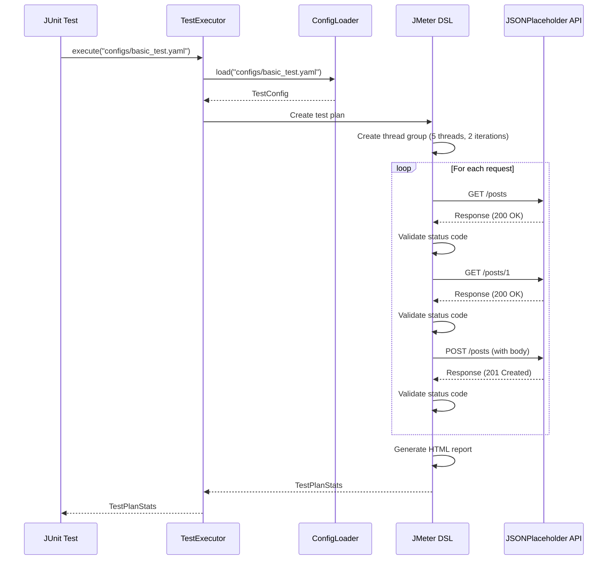

# Basic Example

## Overview

This guide walks through a basic example of using the JMeter DSL Framework to test a simple REST API. We'll create a test that performs GET and POST requests to a public API.

## Prerequisites

- JMeter DSL Framework installed as described in the [Getting Started Guide](../guides/getting-started.md)
- Basic understanding of YAML configuration as detailed in the [Configuration Guide](../guides/configuration.md)

## Step 1: Create the YAML Configuration

Create a file named `basic_test.yaml` in the `src/test/resources/configs` directory:

```yaml
name: Basic API Test
description: A simple test of the JSONPlaceholder API

variables:
  baseUrl: https://jsonplaceholder.typicode.com

execution:
  threadCount: 5
  iterations: 2
  rampUpPeriod: 1
  successThreshold: 95.0

scenarios:
  - name: Posts API
    requests:
      - name: Get Posts
        endpoint: ${baseUrl}/posts
        method: GET
        statusCode: 200
        
      - name: Get Single Post
        endpoint: ${baseUrl}/posts/1
        method: GET
        statusCode: 200
        
      - name: Create Post
        endpoint: ${baseUrl}/posts
        method: POST
        statusCode: 201
        headers: headers/content_type_json.json
        body: body/create_post.json
```

## Step 2: Create the Headers File

Create a file named `content_type_json.json` in the `src/test/resources/headers` directory:

```json
{
  "Content-Type": "application/json",
  "Accept": "application/json"
}
```

## Step 3: Create the Request Body

Create a file named `create_post.json` in the `src/test/resources/body` directory:

```json
{
  "title": "Test Post",
  "body": "This is a test post created by the JMeter DSL Framework",
  "userId": 1
}
```

## Step 4: Create a JUnit Test Class

Create a test class that will execute the test:

```java
package com.perftest;

import com.perftest.core.TestExecutor;
import org.junit.jupiter.api.Test;
import us.abstracta.jmeter.javadsl.core.TestPlanStats;

public class BasicApiTest {

    @Test
    public void runBasicTest() throws Exception {
        TestExecutor executor = new TestExecutor();
        TestPlanStats stats = executor.execute("configs/basic_test.yaml");
        
        // The test will automatically validate against the success threshold
    }
}
```

## Step 5: Run the Test

Run the test using Maven:

```bash
mvn clean test -Dtest=BasicApiTest
```

## Test Execution Flow



## Expected Output

During test execution, you should see log output similar to this:

```
INFO  - Loaded test configuration:
- Number of scenarios: 1
- Thread count: 5
- Iteration count: 2
INFO  - Building HTTP sampler for request: Get Posts
INFO  - Using response code assertion with status code: 200
INFO  - Added response code assertion for endpoint: ${baseUrl}/posts. Expecting status code: 200
INFO  - Building HTTP sampler for request: Get Single Post
INFO  - Using response code assertion with status code: 200
INFO  - Added response code assertion for endpoint: ${baseUrl}/posts/1. Expecting status code: 200
INFO  - Building HTTP sampler for request: Create Post
INFO  - Using response code assertion with status code: 201
INFO  - Added response code assertion for endpoint: ${baseUrl}/posts. Expecting status code: 201
INFO  - HTML report will be generated at: target/reports/test_20250505_123456
INFO  - Test execution completed. Reports available at:
INFO  - HTML report: target/reports/test_20250505_123456
INFO  - Test execution completed. Success rate: 100.00%, Threshold: 95.00%
```

## HTML Report

After test execution, you can view the HTML report in the `target/reports/test_[timestamp]` directory. The report includes:

- Summary statistics
- Response time graphs
- Throughput information
- Error details (if any)

## Next Steps

Now that you've created a basic test, you can explore more advanced features:

- [Multiple Scenarios](multiple-scenarios.md) - Test multiple API endpoints in separate scenarios
- [Variable Usage](variable-usage.md) - Use variables to make your tests more flexible
- [Test Design Guide](../guides/test-design.md) - Validate response content beyond status codes