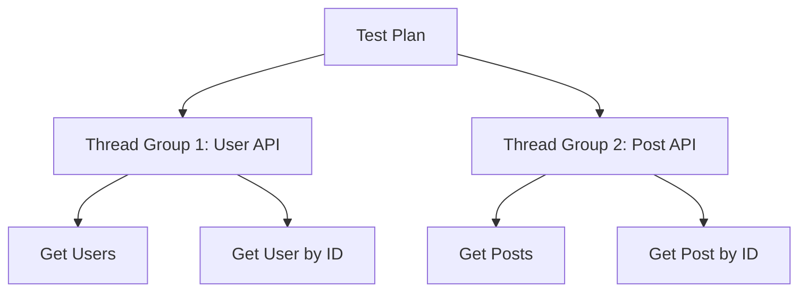
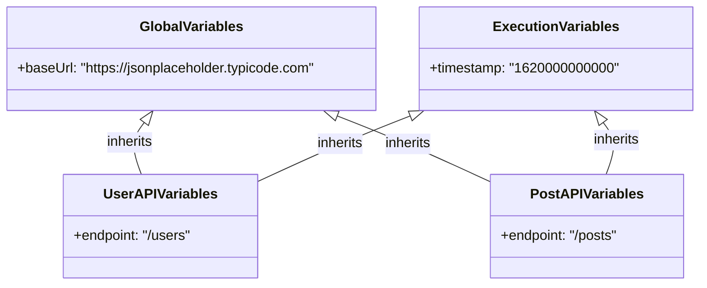
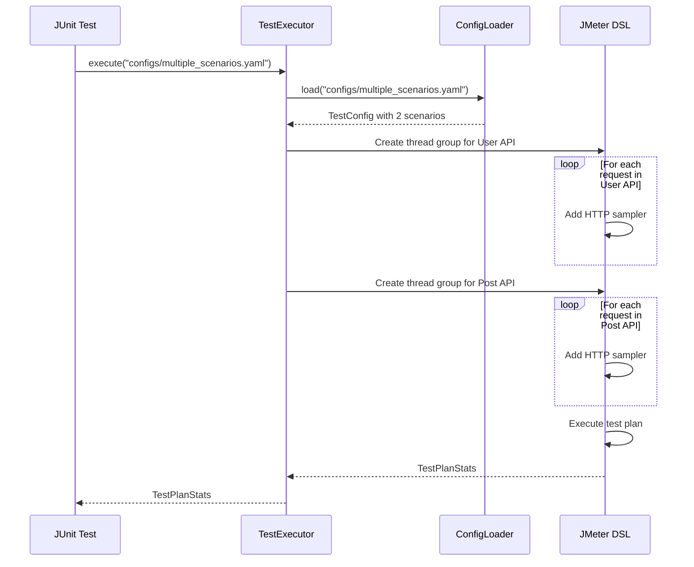

# Multiple Scenarios

## Overview

The JMeter DSL Framework allows you to define multiple test scenarios within a single test configuration. This enables you to test different aspects of your API or simulate different user workflows in a single test execution.

## Why Use Multiple Scenarios?

There are several reasons to use multiple scenarios in your tests:

1. **Test Different API Areas**: Test different parts of your API independently
2. **Different User Workflows**: Simulate different user behaviors or journeys
3. **Isolate Performance Metrics**: Get separate performance statistics for each scenario
4. **Different Variable Sets**: Use different sets of variables for different types of requests

## Example Configuration

Here's an example YAML configuration that defines multiple scenarios:

```yaml
name: Multiple Scenarios Example
description: Demonstrates using multiple scenarios in a single test

variables:
  baseUrl: https://jsonplaceholder.typicode.com

execution:
  threadCount: 5
  iterations: 3
  rampUpPeriod: 2
  successThreshold: 95.0

scenarios:
  - name: User API
    variables:
      endpoint: /users
    requests:
      - name: Get Users
        endpoint: ${baseUrl}${endpoint}
        method: GET
        statusCode: 200
        
      - name: Get User by ID
        endpoint: ${baseUrl}${endpoint}/1
        method: GET
        statusCode: 200
        
  - name: Post API
    variables:
      endpoint: /posts
    requests:
      - name: Get Posts
        endpoint: ${baseUrl}${endpoint}
        method: GET
        statusCode: 200
        
      - name: Get Post by ID
        endpoint: ${baseUrl}${endpoint}/1
        method: GET
        statusCode: 200
```

## Scenario Execution

When you execute a test with multiple scenarios, each scenario is created as a separate thread group in JMeter. This means that each scenario runs independently with its own set of threads.



The thread count specified in the execution configuration applies to each scenario. So in the example above, each scenario would run with 5 threads, for a total of 10 threads across both scenarios.

## Thread Group Configuration

Each scenario thread group inherits the following properties from the execution configuration:

- `threadCount`: Number of concurrent users
- `iterations`: Number of times each user executes the scenario
- `rampUpPeriod`: Time to start all threads

```mermaid
gantt
    title Thread Execution (2 Scenarios, 5 Threads Each)
    dateFormat s
    axisFormat %S
    
    section User API
    Thread 1   : 0, 10
    Thread 2   : 0, 10
    Thread 3   : 1, 11
    Thread 4   : 1, 11
    Thread 5   : 2, 12
    
    section Post API
    Thread 1   : 0, 10
    Thread 2   : 0, 10
    Thread 3   : 1, 11
    Thread 4   : 1, 11
    Thread 5   : 2, 12
```



## Variable Scope

Variables are scoped to their respective levels:

- **Global Variables**: Available to all scenarios
- **Execution Variables**: Available to all scenarios
- **Scenario Variables**: Available only within a specific scenario
- **Request Variables**: Available only within a specific request

This allows you to define scenario-specific variables that are shared among all requests within that scenario, but not with other scenarios.



## JUnit Test Example

Here's a JUnit test that executes a test plan with multiple scenarios:

```java
package com.perftest;

import com.perftest.core.TestExecutor;
import org.junit.jupiter.api.Test;
import us.abstracta.jmeter.javadsl.core.TestPlanStats;

public class MultipleScenarioTest {

    @Test
    public void runMultiScenarioTest() throws Exception {
        TestExecutor executor = new TestExecutor();
        TestPlanStats stats = executor.execute("configs/multiple_scenarios.yaml");
        
        // The test will automatically validate against the success threshold
    }
}
```

## Test Execution Flow



## HTML Report

The HTML report will show separate statistics for each request in each scenario, allowing you to analyze the performance of different API areas independently.

## Best Practices

### Scenario Organization

- Group related requests into the same scenario
- Use descriptive names for scenarios
- Keep scenarios focused on a specific API area or user workflow

### Thread Configuration

- Consider the relative importance of each scenario when setting thread counts
- For more control, consider creating separate test configurations for different scenarios

### Variable Management

- Use scenario variables for values that are specific to a scenario
- Use global variables for values that are shared across scenarios

## Conclusion

Using multiple scenarios in your tests allows you to:

1. Test different parts of your API in a single test run
2. Get separate performance metrics for different API areas
3. Simulate different user workflows
4. Use different variable sets for different types of requests

This flexibility makes the JMeter DSL Framework suitable for a wide range of performance testing needs.