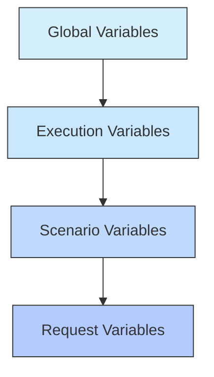
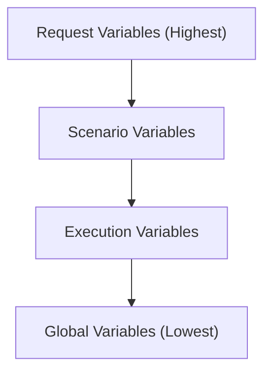
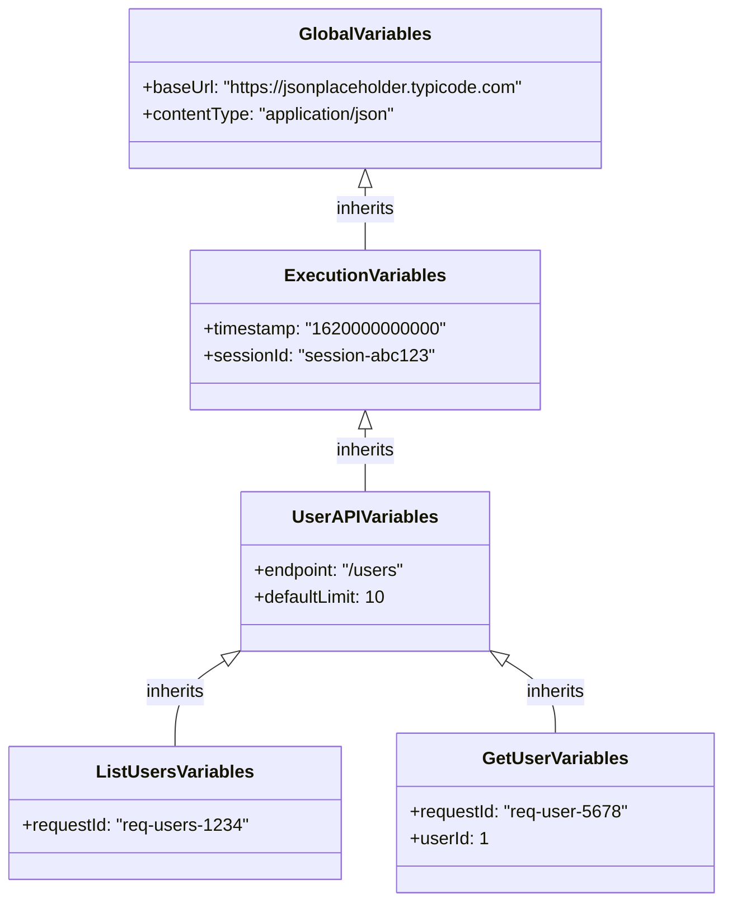

# Variable Usage

## Overview

Variables are a powerful feature of the JMeter DSL Framework that allow you to make your tests more flexible, reusable, and maintainable. This guide demonstrates various ways to use variables effectively in your test configurations.

## Variable Levels

The framework supports variables at four levels, each with its own scope and precedence:



## Example Configuration

Here's a comprehensive example that demonstrates variable usage at all levels:

```yaml
name: Variable Usage Example
description: Demonstrates various ways to use variables

# Global variables - available to all scenarios and requests
variables:
  baseUrl: https://jsonplaceholder.typicode.com
  apiVersion: ""
  contentType: application/json

execution:
  threadCount: 3
  iterations: 2
  rampUpPeriod: 1
  successThreshold: 95.0
  # Execution variables - available to all scenarios and requests
  variables:
    timestamp: ${__time()}
    sessionId: "session-${__randomString(8)}"

scenarios:
  - name: User API
    # Scenario variables - available only to requests in this scenario
    variables:
      endpoint: /users
      defaultLimit: 10
    requests:
      - name: List Users
        endpoint: ${baseUrl}${endpoint}?limit=${defaultLimit}
        method: GET
        statusCode: 200
        headers: headers/common_headers.json
        # Request variables - available only to this request
        variables:
          requestId: "req-users-${__randomString(4)}"
        
      - name: Get User
        endpoint: ${baseUrl}${endpoint}/1
        method: GET
        statusCode: 200
        headers: headers/common_headers.json
        # Different request variables
        variables:
          requestId: "req-user-${__randomString(4)}"
          userId: 1
        
  - name: Post API
    # Different scenario variables
    variables:
      endpoint: /posts
      format: json
    requests:
      - name: List Posts
        endpoint: ${baseUrl}${endpoint}?format=${format}
        method: GET
        statusCode: 200
        headers: headers/common_headers.json
        # Request variables
        variables:
          requestId: "req-posts-${__randomString(4)}"
        
      - name: Get Post
        endpoint: ${baseUrl}${endpoint}/1
        method: GET
        statusCode: 200
        headers: headers/common_headers.json
        # Request variables
        variables:
          requestId: "req-post-${__randomString(4)}"
          postId: 1
```

## Variable Resolution

Variables are resolved in the following order (highest precedence first):

1. Request variables
2. Scenario variables
3. Execution variables
4. Global variables



This means that if the same variable is defined at multiple levels, the value from the most specific level will be used.

## Variable Usage in Headers

Variables can be used in header files:

```json
{
  "Content-Type": "${contentType}",
  "Accept": "application/json",
  "Authorization": "Bearer ${token}",
  "X-Request-ID": "${requestId}",
  "X-Session-ID": "${sessionId}"
}
```

## Variable Usage in Request Bodies

Variables can be used in request body files:

```json
{
  "name": "${userName}",
  "email": "${userEmail}",
  "timestamp": ${timestamp},
  "sessionId": "${sessionId}"
}
```

## Variable Usage in Parameters

Variables can be used in parameter files:

```
format=${format}
limit=${defaultLimit}
timestamp=${timestamp}
requestId=${requestId}
```

## Built-in Functions

The framework supports several built-in functions for generating dynamic values:

### Time Functions

```yaml
variables:
  currentTime: ${__time()}
  formattedTime: ${__timeShift(yyyy-MM-dd'T'HH:mm:ss,0,d)}
  futureTime: ${__timeShift(yyyy-MM-dd,7,d)}
```

### Random Functions

```yaml
variables:
  randomNumber: ${__random(1,100)}
  randomString: ${__randomString(10)}
  randomUUID: ${__randomUUID()}
```

## Examples

### Environment-specific Configuration

Use global variables to define environment-specific values:

```yaml
# Development environment
variables:
  baseUrl: https://dev-api.example.com
  apiKey: dev-api-key
  debug: true
```

```yaml
# Production environment
variables:
  baseUrl: https://api.example.com
  apiKey: prod-api-key
  debug: false
```

### Dynamic Data Generation

Use execution variables to generate dynamic data for each test run:

```yaml
execution:
  variables:
    timestamp: ${__time()}
    traceId: ${__randomUUID()}
    correlationId: "corr-${__randomString(10)}"
```

### API Versioning

Use scenario variables to test different API versions:

```yaml
scenarios:
  - name: API v1
    variables:
      apiVersion: v1
    requests:
      - name: Get Resource
        endpoint: ${baseUrl}/${apiVersion}/resource
        method: GET
  
  - name: API v2
    variables:
      apiVersion: v2
    requests:
      - name: Get Resource
        endpoint: ${baseUrl}/${apiVersion}/resource
        method: GET
```

### Request-specific Data

Use request variables for data that's specific to a particular request:

```yaml
requests:
  - name: Create User
    endpoint: ${baseUrl}/users
    method: POST
    variables:
      userName: "Test User"
      userEmail: "test@example.com"
      userAge: 30
    body: body/create_user.json
```

## Variable Inheritance Example

Here's a visualization of how variables are inherited and overridden at different levels:



## Best Practices

### Variable Naming

- Use descriptive variable names that indicate their purpose
- Follow a consistent naming convention (e.g., camelCase)
- Use prefixes to indicate the variable's domain (e.g., `user_`, `api_`)

### Variable Organization

- Define variables at the appropriate level based on their scope
- Avoid duplicating variable definitions at multiple levels
- Group related variables together

### Variable Usage

- Use variables for values that may change between environments or test runs
- Use variables for values that are used in multiple places
- Document variables that have special meaning or format requirements

## Conclusion

Effective use of variables can significantly enhance the flexibility, reusability, and maintainability of your performance tests. By understanding the variable hierarchy and using variables at the appropriate levels, you can create test configurations that are both powerful and easy to manage.