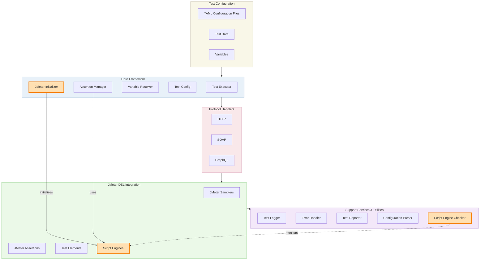
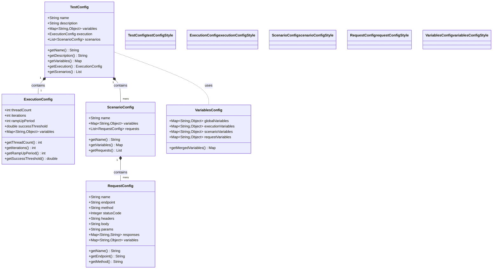
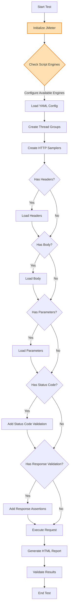
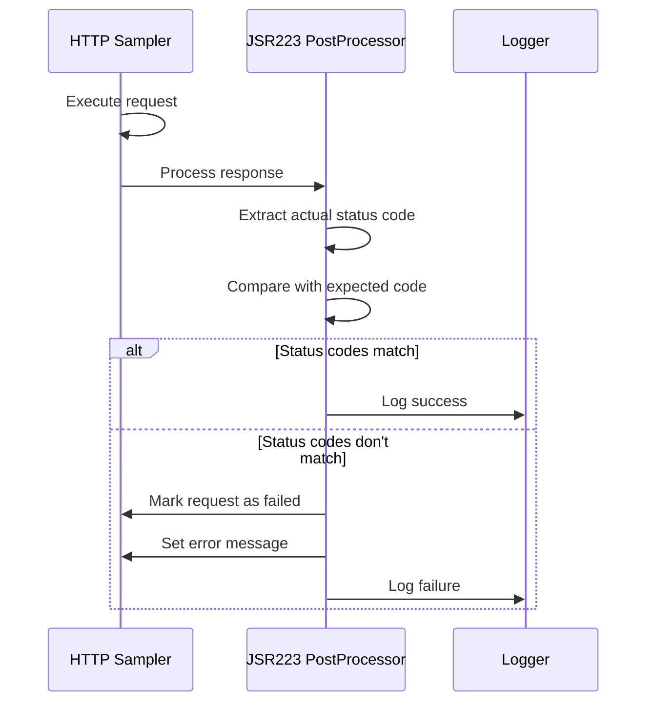
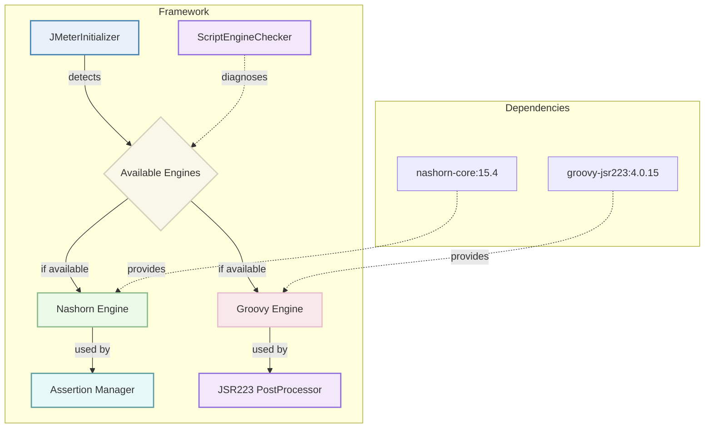

# Framework Architecture

The Performance Automation Framework follows a modular, extensible architecture that provides a solid foundation for API performance testing across multiple protocols (HTTP, SOAP, and GraphQL).

## Architecture Overview

The framework follows a layered architecture with clear separation of concerns. Each layer has specific responsibilities and interacts with adjacent layers through well-defined interfaces.

### High-Level Architecture Diagram



### Component Diagram

```mermaid
classDiagram
    class TestExecutor {
        -TestConfig testConfig
        -ResourceLoader resourceLoader
        -VariableResolver variableResolver
        +execute(String configFile) TestPlanStats
        -buildScenario(DslTestPlan testPlan, ScenarioConfig scenario) void
        -buildSamplers(ScenarioConfig scenario, VariablesConfig variables) List~DslHttpSampler~
    }
    
    class ConfigLoader {
        +load(String configFile) TestConfig
    }
    
    class ResourceLoader {
        +loadResource(String path) String
    }
    
    class VariableResolver {
        +resolveVariables(String template, Map variables) String
    }
    
    class AssertionManager {
        +addStatusCodeAssertion(HTTPSamplerProxy sampler, int statusCode)
        +addJsonPathAssertion(HTTPSamplerProxy sampler, String jsonPath, String expectedValue)
        +addXPathAssertion(HTTPSamplerProxy sampler, String xpath, String expectedValue)
        +addResponseTimeAssertion(HTTPSamplerProxy sampler, long maxTime)
    }
    
    class JMeterInitializer {
        -boolean javascriptEngine
        -boolean groovyEngine
        +initialize() void
        +isJavaScriptEngineAvailable() boolean
        +isGroovyEngineAvailable() boolean
        -detectScriptEngines() void
        -setSystemProperties() void
    }
    
    class ScriptEngineChecker {
        +main(String[] args) void
        +checkAvailableEngines() void
        +displayEngineDetails(ScriptEngineFactory factory) void
        +testCreateEngine(ScriptEngineFactory factory) void
    }
    
    class ProtocolHandler {
        <<interface>>
        +createSampler(RequestConfig config) HTTPSamplerProxy
    }
    
    class HttpHandler {
        +createSampler(RequestConfig config) HTTPSamplerProxy
    }
    
    class SoapHandler {
        +createSampler(RequestConfig config) HTTPSamplerProxy
    }
    
    class GraphQlHandler {
        +createSampler(RequestConfig config) HTTPSamplerProxy
    }
    
    TestExecutor --> ConfigLoader : uses
    TestExecutor --> ResourceLoader : uses
    TestExecutor --> VariableResolver : uses
    TestExecutor --> AssertionManager : uses
    TestExecutor --> JMeterInitializer : initializes
    TestExecutor --> ProtocolHandler : uses
    AssertionManager --> JMeterInitializer : checks engine availability
    JMeterInitializer <.. ScriptEngineChecker : diagnoses
    ProtocolHandler <|-- HttpHandler : implements
    ProtocolHandler <|-- SoapHandler : implements
    ProtocolHandler <|-- GraphQlHandler : implements
    
    %% Styling for classes
    classDef executorStyle fill:#e8f1f9,stroke:#4682b4,stroke-width:2px
    classDef loaderStyle fill:#f9f7e8,stroke:#d6cfbd,stroke-width:2px
    classDef resolverStyle fill:#ebf9e8,stroke:#8fbc8f,stroke-width:2px
    classDef assertionStyle fill:#f9e8ea,stroke:#e6becd,stroke-width:2px
    classDef interfaceStyle fill:#f3e8f9,stroke:#9370db,stroke-width:2px,stroke-dasharray: 5 5
    classDef handlerStyle fill:#e8f9f9,stroke:#5f9ea0,stroke-width:2px
    classDef scriptEngineStyle fill:#ffe0b2,stroke:#f57c00,stroke-width:2px
    
    class TestExecutor executorStyle
    class ConfigLoader loaderStyle
    class ResourceLoader loaderStyle
    class VariableResolver resolverStyle
    class AssertionManager assertionStyle
    class JMeterInitializer scriptEngineStyle
    class ScriptEngineChecker scriptEngineStyle
    class ProtocolHandler interfaceStyle
    class HttpHandler handlerStyle
    class SoapHandler handlerStyle
    class GraphQlHandler handlerStyle
```



## Core Components

### TestExecutor

The `TestExecutor` is the central component responsible for orchestrating the test execution process. It:

- Loads and parses test configuration files
- Resolves variables in configurations
- Creates appropriate samplers for each protocol
- Applies assertions and validations
- Executes the test plan
- Collects and processes results

### Assertion Manager

The `AssertionManager` handles all aspects of response validation. It:

- Creates appropriate assertions based on test configuration
- Adds status code validations
- Implements JSON Path validations for REST/GraphQL
- Implements XPath validations for SOAP/XML
- Validates response times against thresholds
- Provides extensible validation framework

### Variable Resolver

The `VariableResolver` handles dynamic variable substitution in test configurations. It:

- Resolves variables at global, scenario, and request levels
- Maintains proper variable precedence
- Supports default values and nested variables
- Integrates with environment variables
- Handles variable resolution in different contexts (URLs, headers, bodies)

### Test Config

The `TestConfig` component manages test configuration data. It:

- Parses YAML configuration files
- Validates configuration structure
- Provides access to configuration properties
- Supports inheritance and overrides
- Maintains test execution parameters

### Resource Loader

Handles the loading of resource files such as headers, bodies, and parameters. It:

- Loads files from various locations
- Handles different file formats
- Supports template rendering
- Manages resource caching

## Configuration Components



## Protocol Handlers

### HTTP Handler

The HTTP handler manages REST API testing. It:

- Creates HTTP samplers for different methods (GET, POST, PUT, DELETE, etc.)
- Handles request headers and query parameters
- Manages request bodies in different formats (JSON, XML, form data)
- Applies JSON Path assertions for response validation
- Handles content-type specific processing

### SOAP Handler

The SOAP handler manages SOAP API testing. It:

- Creates HTTP samplers with SOAP-specific configurations
- Manages SOAP envelopes and SOAPAction headers
- Handles XML namespaces and WSDL integration
- Applies XPath assertions for response validation
- Processes SOAP faults and error responses

### GraphQL Handler

The GraphQL handler manages GraphQL API testing. It:

- Creates HTTP POST samplers with GraphQL payloads
- Manages GraphQL queries, mutations, and variables
- Handles operation names for complex queries
- Applies JSON Path assertions for response validation
- Processes GraphQL-specific error responses

## Support Services

### Test Logger

The `TestLogger` provides comprehensive logging functionality. It:

- Logs at different severity levels (INFO, WARN, ERROR, DEBUG)
- Supports file-based and console logging
- Includes context information in log messages
- Formats logs for readability and processing
- Integrates with Log4j2 for advanced logging capabilities

### Test Reporter

The `TestReporter` generates test execution reports. It:

- Processes JMeter JTL files for result data
- Generates HTML reports with charts and tables
- Calculates performance statistics
- Categorizes and summarizes errors
- Provides customizable reporting templates

## HTTP Request Flow



## Status Code Validation

For HTTP status code validation, the framework uses a JSR223 PostProcessor to directly check the response code against the expected value specified in the YAML configuration:



The implementation uses a Groovy script (updated for Java 21 compatibility):

```groovy
int expectedStatusCode = 200; // From YAML config
String actualStatusCode = prev.getResponseCode();
try {
    int actualCode = Integer.parseInt(actualStatusCode.trim());
    log.info("Checking status code: expected=" + expectedStatusCode + ", actual=" + actualCode);
    
    if (actualCode != expectedStatusCode) {
        prev.setSuccessful(false);
        prev.setResponseMessage("Status code validation failed: expected " + expectedStatusCode + " but got " + actualCode);
        log.error("Status code validation failed for " + vars.get("resolvedEndpoint"));
    }
    else {
        log.info("Status code validation passed");
    }
} catch (Exception e) {
    log.error("Error parsing status code: " + e.getMessage());
    prev.setSuccessful(false);
}
```

## Resource Organization

Resources are organized into six distinct folders:

```
src/test/resources/
├── body/       # Request bodies (JSON, XML, etc.)
├── headers/    # HTTP headers in JSON format
├── params/     # URL parameters
├── schemas/    # JSON schemas for validation
├── configs/    # YAML configuration files
└── data/       # Test data files (CSV, etc.)
```

## Design Patterns

The framework uses several design patterns to promote maintainability and extensibility:

### Factory Pattern

Used to create appropriate samplers for different protocols:

```java
public interface SamplerFactory {
    HTTPSamplerProxy createSampler(RequestConfig config);
}

public class HttpSamplerFactory implements SamplerFactory {
    @Override
    public HTTPSamplerProxy createSampler(RequestConfig config) {
        // Create HTTP sampler
    }
}

public class SoapSamplerFactory implements SamplerFactory {
    @Override
    public HTTPSamplerProxy createSampler(RequestConfig config) {
        // Create SOAP sampler
    }
}
```

### Builder Pattern

Used to construct complex objects like test plans:

```java
public class TestPlanBuilder {
    private TestPlan testPlan;
    
    public TestPlanBuilder() {
        this.testPlan = new TestPlan();
    }
    
    public TestPlanBuilder withName(String name) {
        testPlan.setName(name);
        return this;
    }
    
    public TestPlanBuilder withThreadGroup(ThreadGroup threadGroup) {
        testPlan.addThreadGroup(threadGroup);
        return this;
    }
    
    public TestPlan build() {
        return testPlan;
    }
}
```

### Strategy Pattern

Used for different validation strategies:

```java
public interface ValidationStrategy {
    void validate(HTTPSamplerProxy sampler, RequestConfig config);
}

public class StatusCodeValidation implements ValidationStrategy {
    @Override
    public void validate(HTTPSamplerProxy sampler, RequestConfig config) {
        // Add status code assertion
    }
}

public class JsonPathValidation implements ValidationStrategy {
    @Override
    public void validate(HTTPSamplerProxy sampler, RequestConfig config) {
        // Add JSON Path assertion
    }
}
```

## Error Handling

The framework implements a comprehensive error handling strategy:

1. **Error Detection**:
   - HTTP status code validation
   - Response content validation
   - Response time threshold validation
   - Custom validation rules

2. **Error Classification**:
   - Connection errors (network issues)
   - Validation errors (assertion failures)
   - Configuration errors (invalid config)
   - Execution errors (JMeter issues)

3. **Error Reporting**:
   - Detailed error messages
   - Context information
   - Stack traces for exceptions
   - Error categorization

4. **Error Recovery**:
   - Retry logic for transient failures
   - Graceful degradation
   - Configurable failure thresholds

## Extensibility

The framework is designed for extensibility in several dimensions:

### New Protocols

Adding support for a new protocol involves:

1. Creating a new protocol handler class
2. Implementing the SamplerFactory interface
3. Adding protocol-specific configuration options
4. Implementing appropriate validation strategies

### Custom Validations

Adding new validation types involves:

1. Creating a new ValidationStrategy implementation
2. Adding configuration options for the validation
3. Registering the validation with the AssertionManager

### Custom Reporting

Extending reporting capabilities involves:

1. Creating new report templates
2. Implementing custom data processors
3. Adding new visualizations or metrics

## Java 21 Compatibility

The framework has been updated for full Java 21 compatibility with enhanced script engine support:

### Script Engine Architecture



### Key Compatibility Updates

1. **Dynamic Script Engine Selection**: The framework automatically detects available script engines and selects the appropriate one at runtime.

2. **Script Engine Dependencies**:
   - Added OpenJDK Nashorn (org.openjdk.nashorn:nashorn-core:15.4) for JavaScript support
   - Updated Groovy scripting engine to version 4.0.15 for JSR223 processor support

3. **Script Syntax Modifications**:
   - Updated JSON path syntax in JavaScript assertions for Nashorn compatibility
   - Modified string handling in Groovy scripts for proper escaping of special characters
   - Updated variable handling in script contexts for compatibility with both engines

4. **Initialization Process**:
   - Added JMeterInitializer to configure script engines and system properties
   - Added ScriptEngineChecker utility for diagnosing script engine availability issues
   - Added automatic fallback mechanisms between JavaScript and Groovy engines
   - Enhanced error handling in JSR223 PostProcessors
   - Ensured proper variable resolution in all contexts

## Future Improvements

Planned improvements for future versions:

1. **Dynamic Test Generation**: Generate tests from API specifications (OpenAPI, WSDL)
2. **Enhanced Reporting**: More detailed performance metrics and visualizations
3. **Correlation Engine**: Automatically extract and correlate dynamic values between requests
4. **Intelligent Retry Logic**: More sophisticated retry strategies for different failure types
5. **Real-time Monitoring**: Live dashboards for test execution status