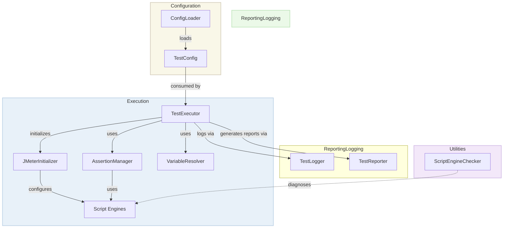

# Framework Components

This guide provides a comprehensive overview of the Performance Automation Framework components, how they interact, and their key functionalities.

## Overview

The Performance Automation Framework is built on a modular architecture with specialized components that handle various aspects of performance testing. The key components include:

- **Assertion Manager**: Handles validation of test responses
- **Configuration Loader**: Loads and parses test configurations
- **Test Executor**: Executes test scenarios and requests
- **Test Logger**: Provides logging capabilities
- **Test Reporter**: Generates test reports
- **Variable Resolver**: Handles variable substitution in test configurations

## Component Interactions



## Assertion Manager

The Assertion Manager centralizes and standardizes all test assertions, providing a flexible way to validate various aspects of test responses.

### Available Assertion Types

| Assertion Type | Description | Configuration Example |
|----------------|-------------|----------------------|
| Status Code | Validates response status code | `statusCode: 200` |
| Response Time | Validates response time is below threshold | `responseTimeThreshold: 2000` |
| Response Size | Validates response size is below threshold | `responseSizeThreshold: 1048576` |
| Contains | Validates response contains specific text | `responses: { Contains: "success" }` |
| JSON Path | Validates JSON path has expected value | `responses: { JsonPath: "$.name=John Doe" }` |
| XPath | Validates XML path has expected value (for SOAP) | `xpath: { expression: "//*[local-name()='Temperature']", expected: "25" }` |

### Error Handling

All assertions include robust error handling:

1. If an assertion fails, it sets the sample result to failed
2. If an exception occurs during assertion evaluation, the error is logged and the test is marked as failed
3. When `failOnError` is set to false, assertion failures are logged as warnings but don't fail the test
4. URL information is included in assertion failure messages to help identify which request failed

### Custom Assertions

You can add custom assertions by implementing a new assertion creator and registering it:

```java
// Create a custom assertion creator
Function<String, DslJsr223PostProcessor> customAssertionCreator = (parameters) -> {
    return JmeterDsl.jsr223PostProcessor(
        "// Custom assertion code here"
    );
};

// Register the custom assertion
assertionManager.registerAssertion("customAssertion", customAssertionCreator);
```

## Configuration Loader

The Configuration Loader is responsible for loading and parsing test configuration files. It supports YAML configurations with a hierarchical structure.

### Configuration Format

```yaml
name: Sample API Test
description: Tests basic API functionality

# Global variables available to all scenarios and requests
variables:
  baseUrl: https://api.example.com
  apiVersion: v1

# Execution parameters
execution:
  threadCount: 10
  iterations: 5
  rampUpPeriod: 2
  successThreshold: 95.0
  variables:
    timestamp: ${__time()}
    sessionId: "session-${__randomString(8)}"

# Test scenarios
scenarios:
  - name: User API Tests
    variables:
      endpoint: /users
    requests:
      - name: Get Users
        endpoint: ${baseUrl}/${apiVersion}${endpoint}
        method: GET
        statusCode: 200
```

### Class Structure

The Configuration Loader uses a hierarchical class structure:

- **TestConfig**: Root configuration class containing global settings
- **ExecutionConfig**: Execution-specific settings
- **ScenarioConfig**: Scenario-specific settings
- **RequestConfig**: Request-specific settings

### Usage Example

```java
// Create a config loader
ConfigLoader configLoader = new ConfigLoader();

// Load a configuration file
try {
    TestConfig config = configLoader.load("configs/sample_test_config.yaml");
    System.out.println("Loaded test configuration: " + config.getName());
    System.out.println("Number of scenarios: " + config.getScenarios().size());
} catch (IOException e) {
    System.err.println("Failed to load configuration: " + e.getMessage());
    e.printStackTrace();
}
```

## Test Logger

The Test Logger provides comprehensive logging functionality with support for different severity levels and structured logging.

### Logging Levels

| Level | Method | Description |
|-------|--------|-------------|
| INFO | `logInfo` | Informational messages about test execution and progress |
| WARN | `logWarn` | Warning messages that don't affect test execution but may indicate issues |
| ERROR | `logError` | Error messages for failures that affect test execution |
| DEBUG | `logDebug` | Detailed diagnostic information for troubleshooting |

### Usage Example

```java
// Initialize the logger
TestLogger.initialize();

// Information messages
TestLogger.logInfo("Test execution started");

// Warning messages
TestLogger.logWarn("Response time exceeded warning threshold: 500ms");

// Error messages
TestLogger.logError("Status code assertion failed: expected 200, got 404");

// Debug messages
TestLogger.logDebug("Request headers: " + headers);

// Log with test and request context
TestLogger.logInfo("HTTP Test", "Get Users", "Sending request to /api/users");
```

### Configuration

The logging system is configured through a `log4j2.xml` file that specifies log appenders and patterns. Logs can be directed to both console and file outputs.

## Test Reporter

The Test Reporter generates comprehensive reports of test execution results, providing detailed insights into test performance and success rates.

### Report Types

- **Summary Report**: High-level overview of test execution
- **Detailed Report**: Detailed information for each request
- **Performance Report**: Focused on performance metrics

### Report Format

The HTML report includes:

- **Dashboard**: High-level overview of the test
- **Statistics**: Detailed numeric data
- **Charts**: Interactive visualizations
- **Errors**: List of errors encountered during the test

### Usage Example

```java
// Create a test reporter
TestReporter reporter = new TestReporter();

// Generate a report from a JTL file
File jtlFile = new File("results/test_results.jtl");
File outputDir = new File("reports/html_report");

try {
    reporter.generateReport(jtlFile, outputDir);
    System.out.println("Report generated successfully: " + outputDir.getAbsolutePath());
} catch (IOException e) {
    System.err.println("Failed to generate report: " + e.getMessage());
}
```

## Variable Resolver

The Variable Resolver handles dynamic variable substitution in test configurations, allowing testers to define variables at different levels and use them throughout the test.

### Variable Syntax

```
${variable_name}
${variable_name:default_value}
```

### Variable Precedence

Variables can be defined at different levels, with the following precedence (highest to lowest):

1. Request-level variables
2. Scenario-level variables
3. Global-level variables
4. Environment variables
5. Default values (if provided)

### Usage Example

```java
// Define variables
Map<String, String> variables = new HashMap<>();
variables.put("baseUrl", "https://api.example.com");
variables.put("userId", "123");

// Resolve variables in a string
String endpoint = "${baseUrl}/users/${userId}";
String resolvedEndpoint = VariableResolver.resolveVariables(endpoint, variables);

// Result: "https://api.example.com/users/123"
```

### Variable Resolution in Different Contexts

The Variable Resolver can handle variables in different contexts:

- In Endpoints: `${baseUrl}/api/${version}/users/${userId}`
- In Headers: `Authorization: Bearer ${token}`
- In Request Bodies: `"userId": ${userId}`
- In SOAP Envelopes: `<web:City>${city}</web:City>`
- In GraphQL Queries: Variables in GraphQL variables object

## Test Executor

The Test Executor is responsible for executing test scenarios and requests based on the test configuration. It coordinates the other components to run the performance tests.

### Key Features

- Execution of HTTP, SOAP, and GraphQL requests
- Support for different thread counts and iterations
- Performance metrics collection
- Result validation through assertions
- HTML report generation

### Usage Example

```java
// Create a test executor
TestExecutor executor = new TestExecutor();

// Load test configuration
TestConfig config = configLoader.load("configs/sample_test_config.yaml");

// Execute the test
TestResult result = executor.execute(config);

// Check the result
if (result.isSuccess()) {
    System.out.println("Test execution successful!");
    System.out.println("Success rate: " + result.getSuccessRate() + "%");
    System.out.println("Average response time: " + result.getAverageResponseTime() + "ms");
} else {
    System.err.println("Test execution failed!");
    System.err.println("Error rate: " + result.getErrorRate() + "%");
    System.err.println("Failed requests: " + result.getFailedRequests());
}
```

## Best Practices

### Assertion Manager

1. Use the appropriate assertion type for each validation requirement
2. Provide meaningful error messages in custom assertions
3. Use failOnError=false for non-critical validations

### Configuration Loader

1. Use descriptive names for configuration files
2. Group related configurations in separate files
3. Use environment-specific configurations

### Test Logger

1. Be consistent with log levels
2. Include context information in log messages
3. Log at the beginning and end of significant operations

### Test Reporter

1. Generate reports automatically after test execution
2. Store reports with timestamps to track performance over time
3. Review error details to identify common issues

### Variable Resolver

1. Use meaningful variable names
2. Define variables at the appropriate level
3. Provide default values for optional variables

### Test Executor

1. Start with low thread counts during development
2. Gradually increase load for stress testing
3. Set appropriate success thresholds based on requirements

## JMeter Initializer

The JMeter Initializer prepares the JMeter environment before test execution. It's particularly important for Java 21 compatibility since it configures script engines and system properties.

### Script Engine Detection

The initializer automatically detects and configures available script engines:

```java
// Check available script engines
ScriptEngineManager manager = new ScriptEngineManager();
for (ScriptEngineFactory factory : manager.getEngineFactories()) {
    for (String name : factory.getNames()) {
        if (name.equalsIgnoreCase("javascript") || name.equalsIgnoreCase("nashorn")) {
            javascriptEngine = true;
        }
        if (name.equalsIgnoreCase("groovy")) {
            groovyEngine = true;
        }
    }
}
```

### System Properties

The initializer sets important system properties for proper operation:

```java
// Set system properties for better JMeter operation
System.setProperty("org.apache.commons.logging.Log", "org.apache.commons.logging.impl.LogKitLogger");
System.setProperty("java.awt.headless", "true");
System.setProperty("jmeter.reportgenerator.exporter.html.property.output_dir", "target/jmeter-reports");
```

### Usage Example

```java
// Initialize JMeter environment
JMeterInitializer.initialize();

// Create and run test plan
DslTestPlan testPlan = JmeterDsl.testPlan(/* test elements */);
TestPlanStats stats = testPlan.run();
```

## Script Engine Checker

The ScriptEngineChecker utility helps diagnose script engine issues that might affect test execution. It's particularly useful when troubleshooting Java 21 compatibility issues.

### Features

- Detects available script engines
- Verifies their compatibility with JMeter DSL requirements
- Provides detailed information about engine versions and capabilities
- Suggests fixes for common issues

### Usage Example

```bash
# Run the script engine checker
java -cp target/jmeter-dsl-framework-1.0.0.jar:target/lib/* com.perftest.utils.ScriptEngineChecker
```

### Sample Output

```
=== Script Engine Availability Check ===
JVM Version: 21.0.1
JVM Vendor: Oracle Corporation
Total Script Engines Found: 4

Engine Name: OpenJDK Nashorn
Engine Version: 15.4
Language Name: ECMAScript
Language Version: ECMA - 262 Edition 5.1
Supported Extensions: js 
Supported MIME Types: application/javascript application/ecmascript text/javascript text/ecmascript 
Supported Names: nashorn Nashorn js JS JavaScript javascript ECMAScript ecmascript 

--> Successfully created engine instance

Engine Name: Groovy Scripting Engine
Engine Version: 4.0.15
Language Name: Groovy
Language Version: 4.0.15
Supported Extensions: groovy Groovy 
Supported MIME Types: application/x-groovy 
Supported Names: groovy Groovy 

--> Successfully created engine instance

=== Script Engine Status for JMeter DSL Framework ===
JavaScript/Nashorn Engine: AVAILABLE ✅
Groovy Engine: AVAILABLE ✅

All required script engines are available! ✅
```

## Future Enhancements

Planned enhancements for framework components include:

- **Assertion Manager**: More assertion types and custom assertion templates
- **Configuration Loader**: Support for more configuration formats and validation
- **Test Logger**: Remote logging and integration with monitoring tools
- **Test Reporter**: Interactive dashboards and comparison reports
- **Variable Resolver**: Variable expressions and functions
- **Test Executor**: More protocol support and distributed testing
- **Script Engines**: Support for additional scripting languages and engines
