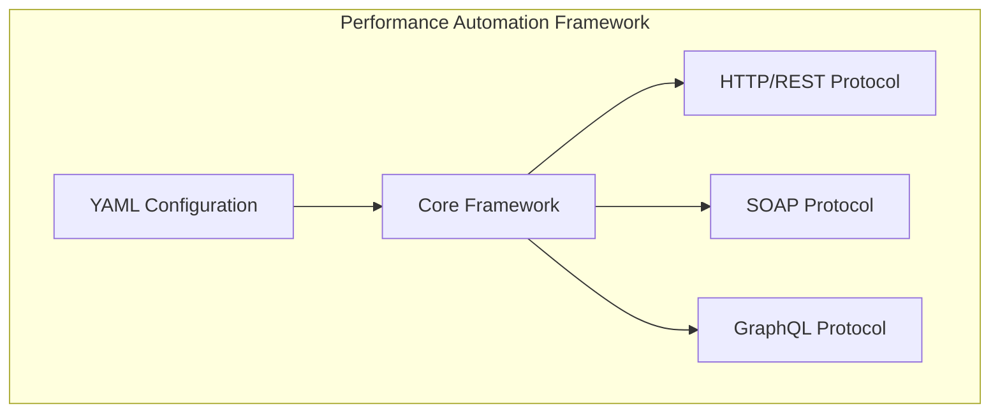

# Protocol Support Guide

The Performance Automation Framework provides comprehensive support for multiple API protocols, allowing you to test various types of services within a single unified framework. This guide covers the three main supported protocols: HTTP/REST, SOAP, and GraphQL.

## Overview

Each protocol has its unique features and configuration options, but they all share a common framework for test execution, reporting, and validation. The framework allows you to:

- Define tests for different protocols in the same YAML configuration
- Use consistent validation mechanisms across protocols
- Share variables between requests of different protocols
- Generate unified reports for all tests



## HTTP/REST Protocol

HTTP/REST is the most common protocol for modern APIs and is fully supported by the framework.

### Features

- Support for all HTTP methods (GET, POST, PUT, DELETE, PATCH, HEAD, OPTIONS)
- Header management for authentication and other purposes
- Request body handling for various content types (JSON, XML, form data)
- Query parameter support
- Response validation including status code and JSON/content validation
- File uploads via multipart/form-data

### Configuration Example

```yaml
scenarios:
  - name: "HTTP API Test"
    requests:
      - name: "Get Users"
        endpoint: "${baseUrl}/users"
        method: GET
        headers: |
          {
            "Accept": "application/json"
          }
        statusCode: 200
        responses:
          JsonPath: "$.length()>0"
          
      - name: "Create User"
        endpoint: "${baseUrl}/users"
        method: POST
        headers: |
          {
            "Content-Type": "application/json"
          }
        body: |
          {
            "name": "John Doe",
            "email": "john@example.com"
          }
        statusCode: 201
```

### Request Configuration Properties

| Property | Description | Required | Default |
|----------|-------------|----------|---------|
| `name` | Name of the request | Yes | - |
| `endpoint` | URL endpoint to call | Yes | - |
| `method` | HTTP method (GET, POST, etc.) | Yes | GET |
| `headers` | Headers file or inline JSON | No | null |
| `body` | Request body file or inline content | No | null |
| `params` | Query parameters file or inline JSON | No | null |
| `statusCode` | Expected HTTP status code | No | null |
| `responseTimeThreshold` | Maximum response time (ms) | No | null |
| `responses` | Response validation rules | No | null |

### Response Validation

```yaml
responses:
  # Validate with JSONPath
  JsonPath: "$.users[0].name=John Doe"
  
  # Check if response contains a string
  Contains: "success"
  
  # Verify response size
  MaxSize: 10240
```

### Authentication Methods

```yaml
# Basic Authentication
headers: |
  {
    "Authorization": "Basic ${basicAuth}"
  }

# Bearer Token
headers: |
  {
    "Authorization": "Bearer ${bearerToken}"
  }

# API Key
headers: |
  {
    "X-API-Key": "${apiKey}"
  }
```

## SOAP Protocol

SOAP is a protocol commonly used in enterprise environments and legacy systems. The framework provides specialized support for SOAP services.

### Features

- SOAP envelope handling with namespace support
- SOAPAction header support
- XPath validation for XML responses
- SOAP fault handling
- XML namespace management

### Configuration Example

```yaml
scenarios:
  - name: "SOAP API Test"
    soapRequests:
      - name: "Get Weather Information"
        endpoint: "${baseUrl}/WeatherService"
        soapAction: "GetWeather"
        soapEnvelope: |
          <soapenv:Envelope xmlns:soapenv="http://schemas.xmlsoap.org/soap/envelope/" xmlns:web="http://www.example.org/weather">
            <soapenv:Header/>
            <soapenv:Body>
              <web:GetWeatherRequest>
                <web:City>New York</web:City>
              </web:GetWeatherRequest>
            </soapenv:Body>
          </soapenv:Envelope>
        statusCode: 200
        xpath:
          - expression: "//m:Temperature"
            expected: "72"
            namespaces:
              m: "http://www.example.org/weather"
```

### SOAP Request Configuration Properties

| Property | Description | Required | Default |
|----------|-------------|----------|---------|
| `name` | Name of the request | Yes | - |
| `endpoint` | SOAP service endpoint URL | Yes | - |
| `soapAction` | SOAPAction header value | Yes | - |
| `soapEnvelope` | SOAP envelope XML content | Yes | - |
| `headers` | Additional HTTP headers | No | null |
| `statusCode` | Expected HTTP status code | No | null |
| `responseTimeThreshold` | Maximum response time (ms) | No | null |
| `xpath` | XPath validation rules | No | null |

### XPath Validation

```yaml
xpath:
  - expression: "//m:City"
    expected: "New York"
    namespaces:
      m: "http://www.example.org/weather"
      soap: "http://schemas.xmlsoap.org/soap/envelope/"
```

### SOAP Authentication (WS-Security)

```yaml
soapEnvelope: |
  <soapenv:Envelope xmlns:soapenv="http://schemas.xmlsoap.org/soap/envelope/">
    <soapenv:Header>
      <wsse:Security xmlns:wsse="http://docs.oasis-open.org/wss/2004/01/oasis-200401-wss-wssecurity-secext-1.0.xsd">
        <wsse:UsernameToken>
          <wsse:Username>${username}</wsse:Username>
          <wsse:Password>${password}</wsse:Password>
        </wsse:UsernameToken>
      </wsse:Security>
    </soapenv:Header>
    <soapenv:Body>
      <!-- Service-specific request elements -->
    </soapenv:Body>
  </soapenv:Envelope>
```

## GraphQL Protocol

GraphQL is a modern API query language that provides a more efficient, powerful alternative to REST. The framework has specialized support for GraphQL APIs.

### Features

- Support for GraphQL queries and mutations
- Operation name support for complex documents
- GraphQL variables
- JSON response validation
- Error handling for GraphQL-specific errors

### Configuration Example

```yaml
scenarios:
  - name: "GraphQL API Test"
    graphQLRequests:
      - name: "Get Country by Code"
        endpoint: "${baseUrl}/graphql"
        query: |
          query GetCountry($code: ID!) {
            country(code: $code) {
              name
              capital
              currency
            }
          }
        graphQLVariables:
          code: "US"
        statusCode: 200
        responses:
          JsonPath: "$.data.country.name=United States"
```

### GraphQL Request Configuration Properties

| Property | Description | Required | Default |
|----------|-------------|----------|---------|
| `name` | Name of the request | Yes | - |
| `endpoint` | GraphQL endpoint URL | Yes | - |
| `query` | GraphQL query or mutation | Yes | - |
| `operationName` | Name of the operation to execute | No | null |
| `graphQLVariables` | Variables for the GraphQL operation | No | null |
| `headers` | Additional HTTP headers | No | null |
| `statusCode` | Expected HTTP status code | No | null |
| `responseTimeThreshold` | Maximum response time (ms) | No | null |
| `responses` | Response validation rules | No | null |

### GraphQL Operations

#### Queries

```graphql
query GetCountry($code: ID!) {
  country(code: $code) {
    name
    capital
    currency
  }
}
```

#### Mutations

```graphql
mutation CreateUser($input: CreateUserInput!) {
  createUser(input: $input) {
    id
    name
    email
  }
}
```

### GraphQL Variables

```yaml
graphQLVariables:
  code: "US"
  limit: 10
  input:
    name: "John Doe"
    email: "john@example.com"
```

### GraphQL Authentication

```yaml
headers: |
  {
    "Authorization": "Bearer ${token}"
  }
```

## Mixed Protocol Example

The framework supports mixing different protocols in the same test configuration:

```yaml
execution:
  threads: 5
  iterations: 3
  successThreshold: 95.0
  variables:
    baseUrl: https://api.example.com
    soapUrl: https://soap.example.com
    graphqlUrl: https://graphql.example.com
    authToken: "${__random(1000,9999)}"

scenarios:
  - name: "Multi-Protocol Test"
    variables:
      userId: 1
    
    # HTTP/REST requests
    requests:
      - name: "Get User Profile"
        endpoint: "${baseUrl}/users/${userId}"
        method: GET
        headers: |
          {
            "Authorization": "Bearer ${authToken}"
          }
        statusCode: 200
    
    # SOAP requests
    soapRequests:
      - name: "Get Weather"
        endpoint: "${soapUrl}/WeatherService"
        soapAction: "GetWeather"
        soapEnvelope: |
          <soapenv:Envelope xmlns:soapenv="http://schemas.xmlsoap.org/soap/envelope/">
            <soapenv:Body>
              <GetWeatherRequest>
                <City>New York</City>
              </GetWeatherRequest>
            </soapenv:Body>
          </soapenv:Envelope>
        statusCode: 200
    
    # GraphQL requests
    graphQLRequests:
      - name: "Get Product Details"
        endpoint: "${graphqlUrl}/graphql"
        query: |
          query GetProduct($id: ID!) {
            product(id: $id) {
              name
              price
            }
          }
        graphQLVariables:
          id: "123"
        statusCode: 200
```

## Protocol-Specific Tips

### HTTP/REST

- Use variables for base URLs and authentication tokens
- Organize requests by resource type or flow
- Use meaningful request names that describe the action
- Validate both status codes and response content
- Set reasonable response time thresholds

### SOAP

- Include all required XML namespaces
- Use XPath validation for important values
- Test both success and fault responses
- Organize SOAP operations logically
- Handle WS-Security properly

### GraphQL

- Request only the fields you need
- Use operations names for clarity
- Test both queries and mutations
- Handle GraphQL errors (even with 200 status codes)
- Use fragments for repeated field selections

## Best Practices for All Protocols

1. **Design tests to match real-world usage**
   - Model user behavior accurately
   - Create realistic test data
   - Use appropriate think times between requests

2. **Validate responses thoroughly**
   - Check status codes
   - Validate response content
   - Verify performance metrics

3. **Structure tests logically**
   - Group related requests in scenarios
   - Order requests in a logical flow
   - Separate concerns by protocol when appropriate

4. **Use variables effectively**
   - Define common values at appropriate levels
   - Extract dynamic values from responses
   - Use built-in functions for generating data

5. **Monitor and analyze results**
   - Review error rates and response times
   - Check for unexpected behaviors
   - Compare results between test runs