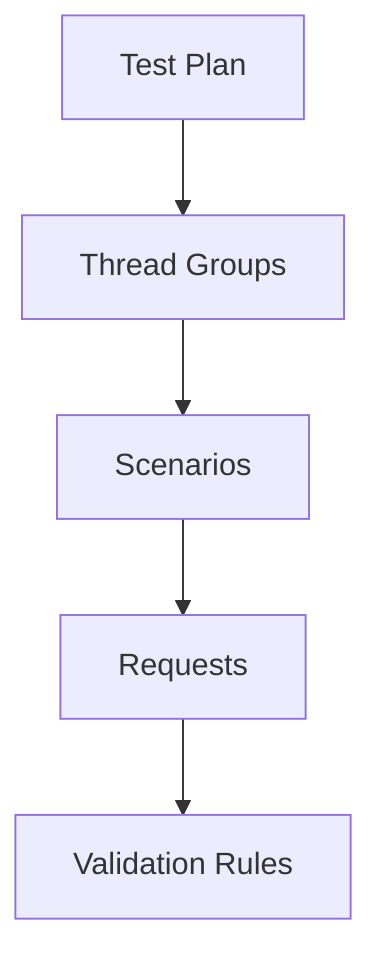

# Test Design Guide

This guide covers the key principles and components for designing effective performance tests with the Performance Automation Framework. It consolidates information about API requests, scenarios, thread groups, and response validation.

## Test Structure Overview

The Performance Automation Framework uses a hierarchical structure to organize tests:



In the YAML configuration, this hierarchy is represented as:

```yaml
# Test Plan
name: API Performance Test
description: Comprehensive API performance test

# Execution configuration (thread groups)
execution:
  threads: 10
  iterations: 5
  rampUpPeriod: 2
  successThreshold: 95.0

# Scenarios
scenarios:
  - name: User API Tests
    variables:
      endpoint: /users
    
    # Requests
    requests:
      - name: Get Users
        endpoint: ${baseUrl}${endpoint}
        method: GET
        statusCode: 200
        
        # Validation rules
        responses:
          JsonPath: "$.length()>0"
```

## API Requests

API requests are the core components of performance tests. Each request represents a single HTTP call to an API endpoint, with associated configuration such as headers, parameters, and validation rules.

### Basic Request Properties

| Property | Description | Required | Example |
|----------|-------------|----------|---------|
| `name` | Name of the request | Yes | `"Get Users"` |
| `endpoint` | The URL to call | Yes | `"${baseUrl}/users"` |
| `method` | HTTP method | Yes | `"GET"`, `"POST"`, `"PUT"`, `"DELETE"` |
| `statusCode` | Expected HTTP status code | No | `200`, `201`, `404` |
| `headers` | Path to headers file or inline JSON | No | `"headers/common_headers.json"` |
| `body` | Path to request body file or inline content | No | `"body/create_user.json"` |
| `params` | Path to parameters file or inline JSON | No | `"params/user_list_params.txt"` |
| `variables` | Request-specific variables | No | `{ "userId": 123 }` |
| `responses` | Response validation rules | No | `{ "JsonPath": "$.name=John" }` |

### Example Requests by Method

#### GET Request

```yaml
- name: Get Users
  endpoint: ${baseUrl}/users
  method: GET
  statusCode: 200
  headers: |
    {
      "Accept": "application/json"
    }
  params: |
    {
      "page": 1,
      "limit": 10
    }
```

#### POST Request

```yaml
- name: Create User
  endpoint: ${baseUrl}/users
  method: POST
  statusCode: 201
  headers: |
    {
      "Content-Type": "application/json"
    }
  body: |
    {
      "name": "John Doe",
      "email": "john@example.com",
      "age": 30
    }
```

#### PUT Request

```yaml
- name: Update User
  endpoint: ${baseUrl}/users/${userId}
  method: PUT
  statusCode: 200
  headers: |
    {
      "Content-Type": "application/json"
    }
  body: |
    {
      "name": "John Updated",
      "email": "john.updated@example.com"
    }
```

#### DELETE Request

```yaml
- name: Delete User
  endpoint: ${baseUrl}/users/${userId}
  method: DELETE
  statusCode: 204
  headers: |
    {
      "Authorization": "Bearer ${token}"
    }
```

### Resource Files

Request-related resources can be stored in external files for better organization:

```
src/test/resources/
├── body/       # Request bodies (JSON, XML, etc.)
├── headers/    # HTTP headers in JSON format
├── params/     # URL parameters
├── schemas/    # JSON schemas for validation
```

#### Headers File Example

```json
{
  "Content-Type": "application/json",
  "Accept": "application/json",
  "Authorization": "Bearer ${token}"
}
```

#### Body File Example

```json
{
  "name": "${userName}",
  "email": "${userEmail}",
  "age": ${userAge}
}
```

#### Parameters File Example

```
page=1
size=10
sort=desc
filter=${filterValue}
```

## Scenarios

Scenarios are groups of related requests that are executed together. They allow you to organize your tests into logical units, each with its own set of variables and requests.

### Scenario Properties

| Property | Description | Required | Example |
|----------|-------------|----------|---------|
| `name` | Name of the scenario | Yes | `"User API Tests"` |
| `variables` | Scenario-specific variables | No | `{ "endpoint": "/users" }` |
| `requests` | Array of requests to execute | Yes | *See examples* |

### Scenario Variables

Variables defined at the scenario level are available to all requests within that scenario but not to requests in other scenarios:

```yaml
scenarios:
  - name: User API Tests
    variables:
      endpoint: /users
      resourceType: user
    requests:
      # These requests can access the 'endpoint' and 'resourceType' variables
      
  - name: Post API Tests
    variables:
      endpoint: /posts
      resourceType: post
    requests:
      # These requests can access the 'endpoint' and 'resourceType' variables,
      # but with different values than in the User API Tests scenario
```

### When to Use Multiple Scenarios vs Multiple Requests

#### Use Multiple Scenarios When:

- You want to test different API areas independently
- You need different variable sets for different groups of requests
- You want to represent different user workflows
- You want to isolate the performance metrics of different API areas

#### Use Multiple Requests Within a Scenario When:

- The requests are closely related and part of the same workflow
- The requests share common variables
- The requests need to be executed in a specific sequence
- You want to measure the combined performance of a sequence of API calls

### Example Scenario

```yaml
scenarios:
  - name: User Management
    variables:
      baseEndpoint: /users
    requests:
      - name: List Users
        endpoint: ${baseUrl}${baseEndpoint}
        method: GET
        statusCode: 200
        
      - name: Get User Details
        endpoint: ${baseUrl}${baseEndpoint}/1
        method: GET
        statusCode: 200
        
      - name: Create User
        endpoint: ${baseUrl}${baseEndpoint}
        method: POST
        statusCode: 201
        headers: headers/content_type_json.json
        body: body/create_user.json
```

## Thread Groups

Thread groups represent virtual users that execute test scenarios. Each thread group consists of one or more threads (virtual users) that execute a sequence of HTTP requests defined in a scenario.

### Thread Group Configuration

Thread groups are automatically created from scenarios defined in the YAML configuration. The thread group properties are derived from the execution configuration:

```yaml
execution:
  threads: 10        # Number of threads (virtual users)
  iterations: 5      # Number of iterations per thread
  rampUpPeriod: 2    # Time in seconds to start all threads
  successThreshold: 95.0 # Minimum success rate required
```

### Thread Group Properties

#### Number of Threads

The `threads` parameter specifies how many concurrent users will execute the scenario. Each thread represents a single user and executes the scenario independently.

#### Iterations

The `iterations` parameter determines how many times each thread will execute the scenario. Each iteration executes all the requests in the scenario in sequence.

#### Ramp-Up Period

The `rampUpPeriod` parameter specifies the time in seconds to start all threads. The threads are started evenly over the ramp-up period.

```mermaid
gantt
    title Thread Start Times (10 threads, 5 second ramp-up)
    dateFormat s
    axisFormat %S
    
    Thread 1   : milestone, m1, 0, 0
    Thread 2   : milestone, m2, 0.5, 0.5
    Thread 3   : milestone, m3, 1, 1
    Thread 4   : milestone, m4, 1.5, 1.5
    Thread 5   : milestone, m5, 2, 2
    Thread 6   : milestone, m6, 2.5, 2.5
    Thread 7   : milestone, m7, 3, 3
    Thread 8   : milestone, m8, 3.5, 3.5
    Thread 9   : milestone, m9, 4, 4
    Thread 10  : milestone, m10, 4.5, 4.5
```



### Load Profiles

The combination of thread count, iterations, and ramp-up period defines the load profile of the test:

#### Constant Load

```yaml
execution:
  threads: 10
  iterations: 10
  rampUpPeriod: 0
```

All threads start immediately and execute for the duration of the test.

#### Gradual Ramp-Up

```yaml
execution:
  threads: 50
  iterations: 5
  rampUpPeriod: 30
```

Threads are started gradually over the ramp-up period, then maintain the full thread count until the test completes.

### Advanced Thread Group Configuration

#### Limited Duration Tests

To run a test for a fixed duration regardless of the number of iterations:

```yaml
execution:
  threads: 10
  iterations: -1       # -1 = infinite iterations
  rampUpPeriod: 5
  durationSeconds: 300 # Run for 5 minutes
```

#### Think Time

To simulate realistic user behavior with pauses between requests:

```yaml
execution:
  threads: 10
  iterations: 5
  rampUpPeriod: 2
  thinkTimeMs: 500     # 500ms delay between requests
```

## Response Validation

The framework provides multiple mechanisms for validating API responses, ensuring that your performance tests also verify functional correctness.

### HTTP Status Code Validation

The framework automatically validates that the response has the expected status code specified in the `statusCode` property:

```yaml
requests:
  - name: Get User
    endpoint: ${baseUrl}/users/1
    method: GET
    statusCode: 200  # Expected status code is 200 OK
```

### Response Content Validation

The `responses` property allows you to specify additional validation rules for the response:

#### JSON Path Validation

```yaml
responses:
  JsonPath: "$.name=John Doe"
```

Multiple JSON Path validations:

```yaml
responses:
  JsonPath:
    - "$.name=John Doe"
    - "$.id=123"
    - "$.active=true"
```

#### Response Contains Validation

```yaml
responses:
  Contains: "success"
```

Multiple content validations:

```yaml
responses:
  Contains:
    - "success"
    - "completed"
```

#### Response Size Validation

```yaml
responses:
  MaxSize: 10240  # bytes
```

#### XPath Validation (for SOAP/XML)

```yaml
xpath:
  - expression: "//m:Temperature"
    expected: "72"
    namespaces:
      m: "http://www.example.org/weather"
      soap: "http://schemas.xmlsoap.org/soap/envelope/"
```

### Success Threshold

The framework allows you to specify a success threshold in the execution configuration. If the percentage of successful requests falls below this threshold, the test will be considered a failure:

```yaml
execution:
  threads: 10
  iterations: 5
  rampUpPeriod: 2
  successThreshold: 95.0  # Test fails if success rate is below 95%
```

## Complete Test Design Example

Here's a comprehensive example that demonstrates the various aspects of test design:

```yaml
name: E-commerce API Performance Test
description: Tests the performance of core e-commerce APIs

variables:
  baseUrl: https://api.example.com
  apiVersion: v1

execution:
  threads: 20
  iterations: 10
  rampUpPeriod: 5
  successThreshold: 95.0
  thinkTimeMs: 500
  variables:
    sessionId: "session-${__randomString(8)}"

scenarios:
  - name: Product Browsing
    variables:
      productsEndpoint: /products
      categoriesEndpoint: /categories
    requests:
      - name: List Categories
        endpoint: ${baseUrl}/${apiVersion}${categoriesEndpoint}
        method: GET
        statusCode: 200
        responses:
          JsonPath: "$.length()>0"
        
      - name: List Products
        endpoint: ${baseUrl}/${apiVersion}${productsEndpoint}
        method: GET
        params: |
          {
            "limit": 20,
            "page": 1
          }
        statusCode: 200
        responses:
          JsonPath: "$.products.length()>0"
        
      - name: Get Product Details
        endpoint: ${baseUrl}/${apiVersion}${productsEndpoint}/12345
        method: GET
        statusCode: 200
        responses:
          JsonPath: 
            - "$.id=12345"
            - "$.name!=null"
            - "$.price>0"
  
  - name: Shopping Cart
    variables:
      cartEndpoint: /cart
      checkout: /checkout
    requests:
      - name: Add to Cart
        endpoint: ${baseUrl}/${apiVersion}${cartEndpoint}
        method: POST
        headers: |
          {
            "Content-Type": "application/json",
            "X-Session-ID": "${sessionId}"
          }
        body: |
          {
            "productId": 12345,
            "quantity": 1
          }
        statusCode: 201
        
      - name: View Cart
        endpoint: ${baseUrl}/${apiVersion}${cartEndpoint}
        method: GET
        headers: |
          {
            "X-Session-ID": "${sessionId}"
          }
        statusCode: 200
        responses:
          JsonPath: "$.items.length()>0"
        
      - name: Checkout
        endpoint: ${baseUrl}/${apiVersion}${checkout}
        method: POST
        headers: |
          {
            "Content-Type": "application/json",
            "X-Session-ID": "${sessionId}"
          }
        body: |
          {
            "paymentMethod": "credit_card",
            "shippingAddress": {
              "street": "123 Test St",
              "city": "Test City",
              "zipCode": "12345"
            }
          }
        statusCode: 200
        responses:
          JsonPath: "$.orderId!=null"
```

## Best Practices

### Organizing Tests

- Group related requests in the same scenario
- Use meaningful names for scenarios and requests
- Keep request bodies and headers in separate files for reusability
- Organize test resources logically

### Test Configuration

- Set appropriate thread counts based on expected load
- Use a reasonable ramp-up period to avoid sudden load spikes
- Define common variables at the appropriate level
- Set realistic think times between requests

### Validation

- Always specify the expected status code
- Add response validation for critical requests
- Use JSON Path expressions to verify specific response elements
- Set appropriate success thresholds

### Performance Considerations

- Start with a small number of threads and gradually increase
- Monitor system resources during test execution
- Consider the test environment's capacity when setting load parameters
- Focus on realistic user scenarios rather than extreme load testing

### Data Management

- Use variables for data that changes between environments
- Consider using data files for large datasets
- Handle test data cleanup to avoid affecting subsequent test runs
- Use dynamic data generation for unique values