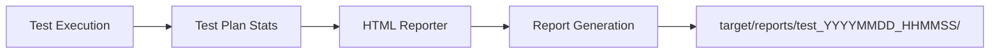
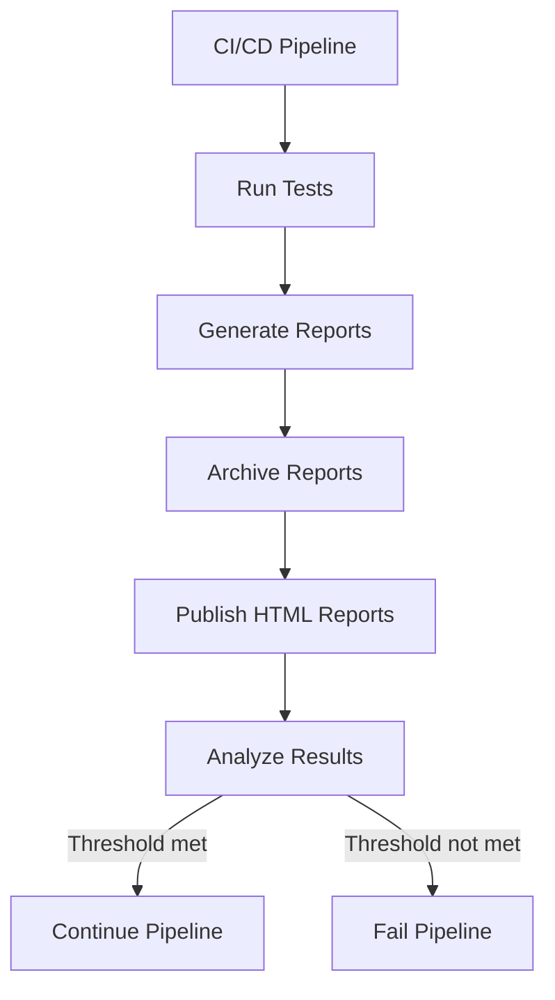

# HTML Reports

## Overview

The JMeter DSL Framework generates comprehensive HTML reports for each test execution. These reports provide detailed insights into the performance of your API endpoints, including response times, throughput, and error rates.

## Report Generation

Reports are automatically generated during test execution and stored in the `target/reports` directory. Each test run creates a unique subdirectory based on the timestamp, ensuring that reports from different test runs are not overwritten.



## Report Structure

The HTML report is organized into several sections:

```
target/reports/test_20250505_073334/
├── 2025-05-05 07-33-34 008f7057-eb35-4ccd-9cdc-c13fffcf8bf1/
│   ├── content/
│   │   ├── css/
│   │   ├── js/
│   │   └── pages/
│   ├── sbadmin2-1.0.7/
│   ├── index.html
│   └── report.jtl
```

## Report Sections

The HTML report contains the following sections:

### Dashboard

Provides an overview of the test execution, including a summary of the key performance metrics:

- Total number of requests
- Success and error percentages
- Average, minimum, and maximum response times
- Throughput (requests per second)

### Statistics

Detailed statistics for each sampler (request) in the test plan, including:

- Response times (average, min, max, 90th percentile, 95th percentile, 99th percentile)
- Throughput
- Error count and percentage
- Bytes received

### Charts

Visual representations of the test results, including:

- Response time over time
- Response time distribution
- Active threads over time
- Bytes throughput over time
- Latencies over time
- Response codes per second

### Errors

Detailed information about any errors that occurred during the test execution, including:

- Error type
- Error message
- Request that caused the error
- Response data

## Integrating Reports with CI/CD

The HTML reports can be integrated into your CI/CD pipeline by configuring your build tool to archive the report artifacts. For example, in Jenkins, you can use the HTML Publisher plugin to publish the reports.



## Customizing Reports

The framework uses JMeter's built-in HTML reporting functionality, which can be customized by modifying the test executor configuration.

### Adding Custom Graphs

You can extend the HTML reporter to include custom graphs by implementing your own JMeter visualization plugins.

### Changing Report Appearance

The appearance of the reports can be customized by modifying the CSS files in the report template.

## Conclusion

The HTML reports generated by the JMeter DSL Framework provide comprehensive insights into the performance of your API endpoints. By analyzing these reports, you can identify performance bottlenecks, track improvements over time, and ensure that your APIs meet your performance requirements.